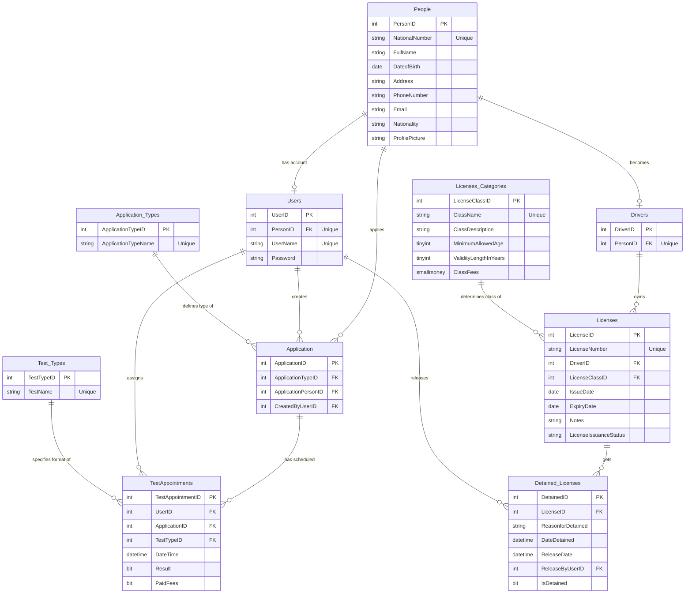

   
# 🚗 Driving & Vehicle Licensing Department (DVLD) Database System

A robust, highly optimized, and normalized relational database schema designed to streamline municipal and government operations for issuing, renewing, testing, and managing driving licenses.

---

## 📌 Project Overview

The DVLD Database serves as the backbone for a comprehensive licensing system. It manages the entire lifecycle of a driver—from their initial personal registration, through application submissions and multi-stage testing, to license issuance, renewals, and even legal detentions (confiscations).

This schema is built adhering to Relational Database Design Best Practices (3NF) to ensure data integrity, eliminate redundancy, and support rapid query performance.

---

## 🛠️ Core Database Modules

The database is logically partitioned into 5 main interconnected modules:

### 1. 🔑 Identity & Access Management (IAM)
* **People Table:** The absolute core of the database. It stores static, immutable personal information for every citizen or resident.
* **Users Table:** Manages administrative security. It links a system user to their physical person profile with support for secure, hashed credentials.

### 2. 📂 Applications & Services
* **Application_Types Table:** A static lookup catalog defining available government services (e.g., New License, Renewal, Replacement).
* **Application Table:** Tracks and logs every service request, linking the applicant, the service type, and the officer who created the record.

### 3. 📝 Testing & Appointments
* **Test_Types Table:** Defines the mandatory exams required for licensing (Vision, Theory, and Practical Road Tests).
* **TestAppointments Table:** Manages booking slots, fees paid, and logs the final evaluation results (Pass/Fail) for each application.

### 4. Drivers Table:ses
* **Drivers Table:** Automatically registers a person as a "Driver" once they qualify for their first license.
* **Licenses_Categories Table:** Defines distinct license classes (e.g., Private, Commercial, Heavy Duty, Motorcycle), including minimum age requirementLicenses Table:spans.
* **Licenses Table:** The actual permit issued to a driver, capturing expiration dates, custom administrative notes, and active status.

### 5. 🛑 Detained_Licenses Table:**Detained_Licenses Table:** Governs the disciplinary and regulatory workflows. It tracks confiscated licenses, the legal reasons for detention, and the secure release process.

---

## 📊 Entity Relationship Summary

Below is a high-level representation of how the primary tables interact within the system:

| From Table | Relation Type | To Table | Business Rule / Purpose |
| :--People| :--- | :--- |
| **People** | 1 ── 0..1 | **Users** | An individual person may or may not have an admPeoplee system account. |
| **People** | 1 ── 0..1 | **Drivers** | A person is promoted to a "DriverUserster earning a license. |
| **Users** | 1 ── 0..* | **Applications** | Tracks which system user/oLicensesssed which application. |
| **Licenses** | 1 ── 0..* | **Detained_Licenses** | A license can be detained (confiscated) multiple times over its lifetime. |

---

## 🚀 Key Technical Highlights

> [!TIP]
> #Strict Constraints:roduction-Ready:
> * **Strict Constraints:** Utilizes UNIQUE indexes on sensitive attributes (NationalNumber, UserName, LicenseNumber) to prevent huEnhanced Security Support: entries.
> * **Enhanced Security Support:** The Password field is allocated nvarchar(255) to accommoBCryptn, sArgon2ing alState Integrity:pt** or **Argon2**.
> * **State Integrity:** Conditional workflows (like releasing a detained license or recording test outcomes) cleanly utilize NULL states to repData Type Optimization: lifecycles.
> * **Data Type Optimization:** Uses memory-efficient data types like tinyint for age limits/years and smallmoney for fees to optimize storage footprint.

---

## 📂 How to Deploy
    1. Clone this repository to your local machine.
2. Open your preferred SQL database management tool (e.g., SSMS, Azure Data Studio).
3. Open and execute the provided SQL script to build the schema:
   `sql
   -- Run the script in your query editor
   CREATE DATABASE DVLD_DB;
   -- Followed by the table creation scripts...

## Author Jafr Jaber -- Github(github.com/jafr543)
